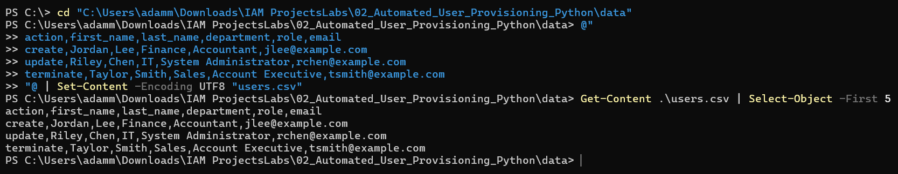
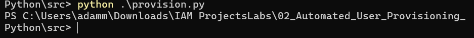
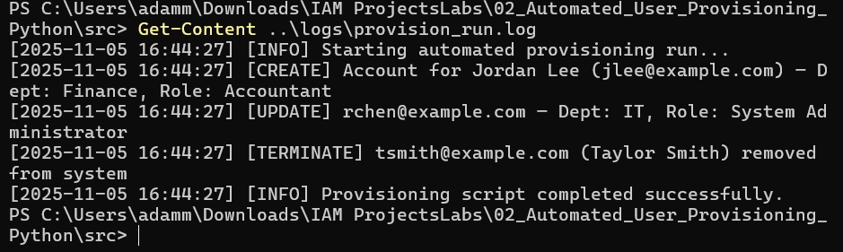
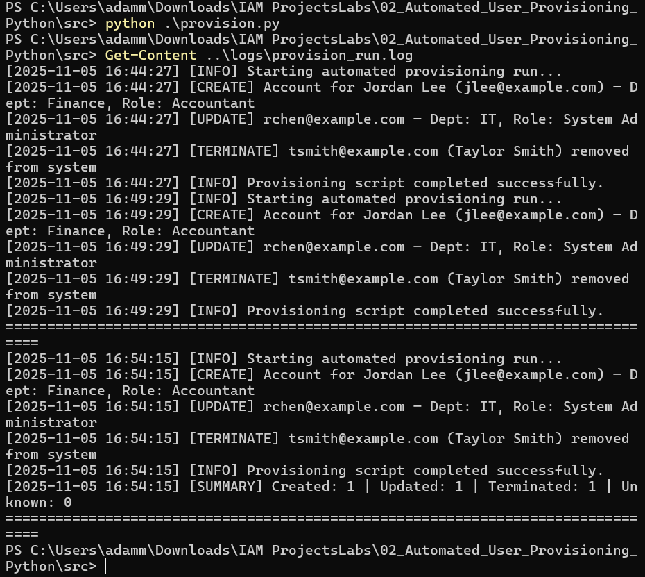
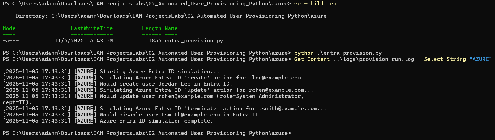
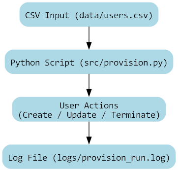

# Automated User Provisioning


[]()

## 🎯 Objective
Automate onboarding and offboarding of users from a CSV file using Python.  
Demonstrates identity lifecycle automation and audit logging with reproducible, provider-agnostic logic.

---

## 🧩 Project Overview

**Workflow Summary:**
1. Input user data (`data/users.csv`)
2. Process via automation script (`src/provision.py`)
3. Log all activities (`logs/provision_run.log`)
4. Visualize workflow (`docs/flow_diagram.png`)

**Core Actions**
- Create new user accounts  
- Update existing accounts  
- Deprovision terminated users  

---

## 🧠 Tech Stack
- **Language:** Python 3.x (Standard Library Only)
- **Platform:** Windows PowerShell
- **Diagram Engine:** Graphviz
- **Logging:** UTF-8 structured event logs

---

## 📂 Folder Structure
```
02_Automated_User_Provisioning_Python/
│
├── data/
│   └── users.csv
├── src/
│   └── provision.py
├── logs/
│   └── provision_run.log
├── docs/
│   ├── flow_diagram.png
│   └── screenshots/
│       ├── 01_data_preview.png
│       ├── 02_script_run.png
│       ├── 03_log_output.png
│       └── 04_enhanced_log_output.png
└── README.md
```

---

## 🧾 Screenshots

| Step | Description | Screenshot |
|------|--------------|-------------|
| 1 | Data preview (`users.csv`) |  |
| 2 | Script execution in PowerShell |  |
| 3 | Log output verification |  |
| 4 | Enhanced log with summary |  |
| 5 | Azure Entra ID simulation log |  |

---

## 🖼️ Workflow Diagram


---

## 🧰 How to Reproduce

1. **Prepare Data**
   ```
   action,first_name,last_name,department,role,email
   create,Jordan,Lee,Finance,Accountant,jlee@example.com
   update,Riley,Chen,IT,System Administrator,rchen@example.com
   terminate,Taylor,Smith,Sales,Account Executive,tsmith@example.com
   ```

2. **Run Script**
   ```powershell
   python .\src\provision.py
   ```

3. **Review Logs**
   ```powershell
   Get-Content .\logs\provision_run.log
   ```

4. **View Diagram**
   ```
   docs\flow_diagram.png
   ```

---

## 📈 Results
All lifecycle events (create / update / terminate) are processed successfully and logged with timestamps, summaries, and consistent formatting.

---


---

## ☁️ Optional Azure Add-On — Entra ID Integration

This module (`azure/entra_provision.py`) simulates Azure Entra ID provisioning actions  
(create, update, terminate) without requiring live credentials or Microsoft authentication.

**To simulate Azure actions:**
```powershell
cd .\azure
python .\entra_provision.py
```

**Expected behavior:**
- Actions log to `logs/provision_run.log` with `[AZURE]` tags  
- Safe to execute offline  
- Mirrors Microsoft Graph API provisioning workflow structure


## ✍️ Author  
**Adam Mukdad**  
📍 Chicago, IL  
📧 [AdamMukdad97@gmail.com](mailto:AdamMukdad97@gmail.com)  
🌐 [adammukdad.github.io](https://adammukdad.github.io/)  
💼 [linkedin.com/in/adammukdad](https://www.linkedin.com/in/adammukdad/)


